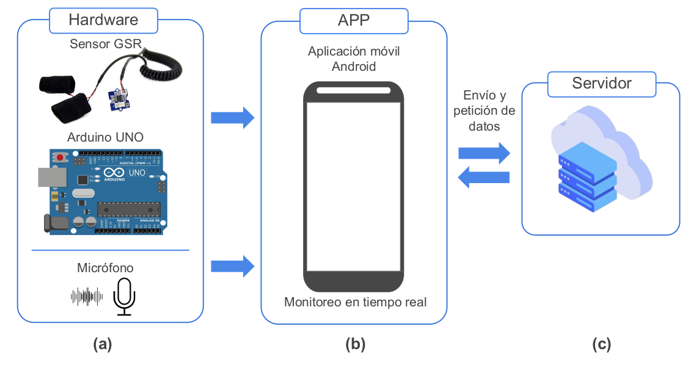
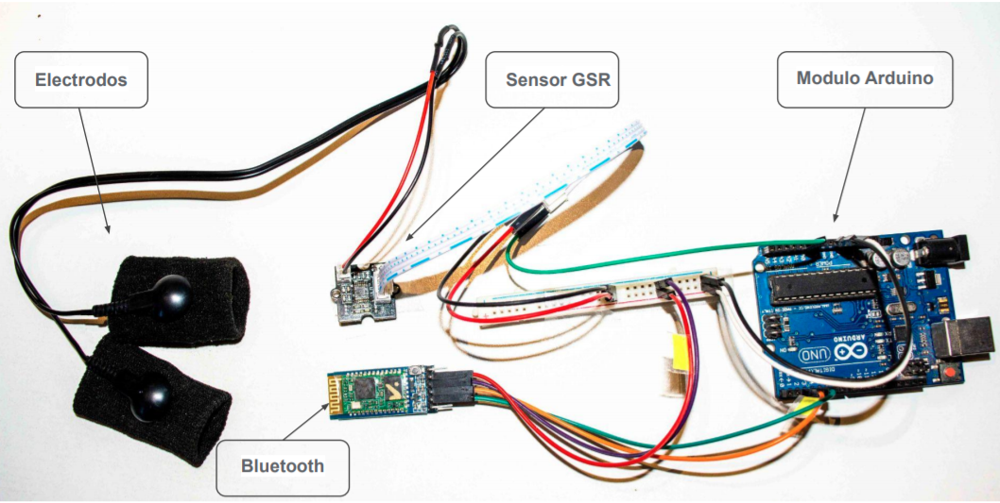
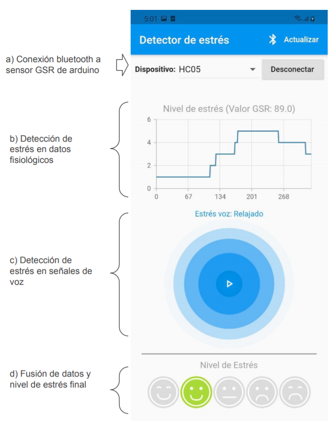
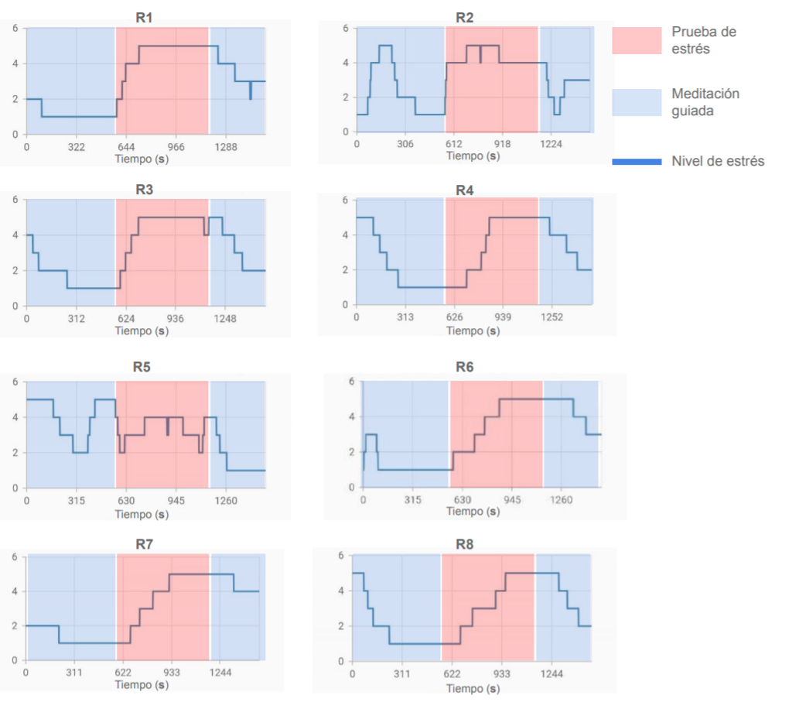
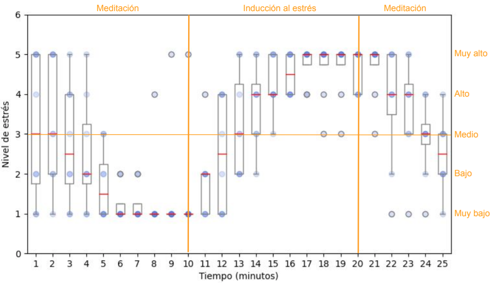
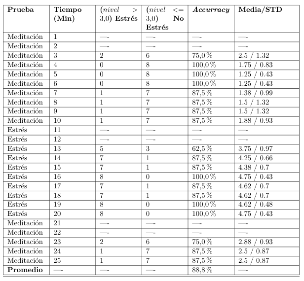

# Detección de niveles de estrés en tiempo real usando señales de voz y datos fisiológicos.
 
 
 
 
En este proyecto se plantea el siguiente diagrama:
 
 

 
 

__Conjuntos de datos usados__

Conjunto de datos de **señales de voz** disponible en:  [RAVDESS](https://www.kaggle.com/uwrfkaggler/ravdess-emotional-speech-audio) y [Emo-DB](http://www.emodb.bilderbar.info/download/)

Conjunto de datos de **Señales de fisiológicas** disponible en:  [WESAD](https://ubicomp.eti.uni-siegen.de/home/datasets/icmi18/)

 
 

# Implementación del detector de estrés V2

 

## Implementación del hardware
Implementacion desarrollado en [Arduino](https://www.arduino.cc/en/software), el código fuente se encuentra en [hardware_GSR/grs_recorder.ino](https://github.com/yonelyvan/stressDetection/blob/master/hardware_GSR/grs_recorder.ino) y el circuito se muestra en la siguiente imagen. 

 

## Implementación del aplicativo móvil
Aplicativo implementado para la plataforma [Android](https://www.android.com/intl/es_es/) usando el framework [Flutter](https://flutter.dev/), el proyecto y código fuente se encuentra en [APP/detector](https://github.com/yonelyvan/stressDetection/tree/master/APP/detector).

__Captura de pantalla de la aplicación:__

 

## Implementación en servidor

Una parte del detector que corresponde a la detección a partir de señales voz, se implementó en un servidor, la tarea es clasificar presencia o ausencia de estrés en audios .wav que son enviados desde la aplicación móvil. Para esto el servidor usa modelos de machine learning entrenados anteriormente y retorna el resultado de la clasificación a la aplicación.

El servidor está implementado en [Node.js](https://nodejs.org/es/) y “micro” Framework escrito en Python llamado [Flask](https://flask.palletsprojects.com/en/2.0.x/)

El codigo fuente se encuentra en la carpeta [/SERVER](https://github.com/yonelyvan/stressDetection/tree/master/SERVER)

 

## Pruebas de estres
Se realizaron pruebas de 25 minutos cada una, cada prueba está estructurada de la siguiente manera: 10 min meditación guiada, 10 min prueba de estrés, 5 min meditación guiada.

Se capturaron las pantallas de todas las pruebas y se analizaron estadísticamente los resultados.

__Capturas de pantallas__

__Diagrama de caja y bigotes de las 8 pruebas durante 25 minutos__

El registro de niveles de estrés de cada prueba en tiempo real se encuentra en la carpeta [data_resultados/data](https://github.com/yonelyvan/stressDetection/tree/master/data_resultados/data)

