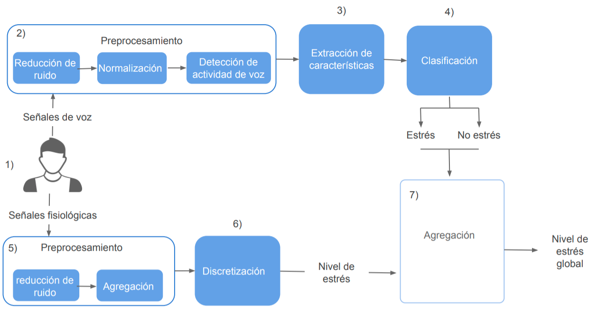

# Detección de niveles de estrés en tiempo real usando señales de voz y datos fisiológicos.
 
 
 
 
En este proyecto se plantea el siguiente diagrama:
 
 

 
La implementación se esta desarrollando usando el lenguaje Python y los avances se muestran en la siguiente tabla:
 
 
<table>
   <thead>
       <tr>
           <th>Actividad</th>
           <th>Descripción</th>
           <th>Avance</th>
       </tr>
   </thead>
   <tbody>
       <tr>
           <td rowspan=3>Señales de voz</td>
           <td>Preprocesamiento</td>
           <td>70%</td>
       </tr>
       <tr>
           <td>Extracción de Características (MFCC, TEO)</td>
           <td>90%</td>
       </tr>
       <tr>
           <td>Clasificadores(SVM, MLP)</td>
           <td>70%</td>
       </tr>
       <tr>
           <td rowspan=2>Señales fisiológicas</td>
           <td>Preprocesamiento</td>
           <td>80%</td>
       </tr>
       <tr>
           <td>Discretización</td>
           <td>90%</td>
       </tr>
       <tr>
           <td rowspan=1>Agregación</td>
           <td></td>
           <td>0%</td>
       </tr>
   </tbody>
</table>

__Conjuntos de datos usados__

Conjunto de datos de **señales de voz** disponible en: https://www.kaggle.com/uwrfkaggler/ravdess-emotional-speech-audio (RAVDESS) y http://www.emodb.bilderbar.info/download/ (Emo-DB)

Conjunto de datos de **Señales de fisiológicas** disponible en: https://ubicomp.eti.uni-siegen.de/home/datasets/icmi18/ (WESAD)
